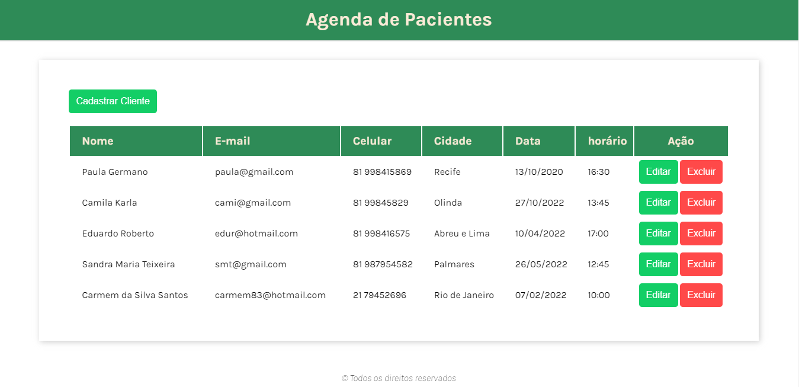
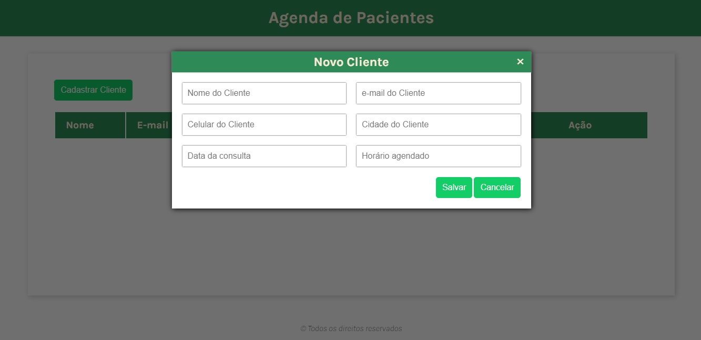
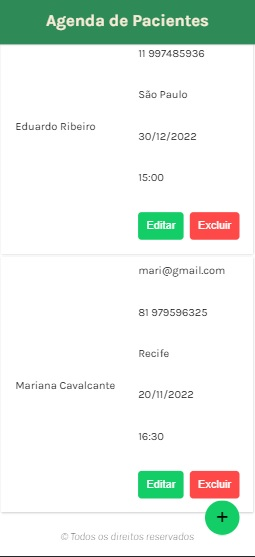
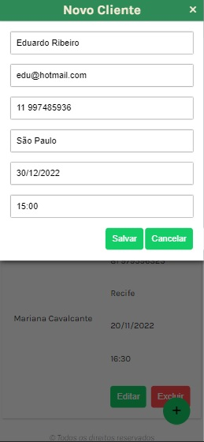

<h1 align="center">Agenda de Pacientes</h1>
<h4 align="center">O usuário poderá visualizar, adicionar, editar ou excluir pacientes agendados para uma consulta</h4>
<h4 align="center">Feito com HTML, CSS e JavaScript</h4>

&#xa0;

**
Sumário
**

<a href="#dart-sobre">Sobre</a> &#xa0; | &#xa0;
<a href="#white_check_mark-funcionalidades">Funcionalidades</a> &#xa0; | &#xa0;
<a href="#computer-tecnologias">Tecnologias</a> &#xa0; | &#xa0;

<a href="#camera-imagens">Imagens</a> &#xa0; | &#xa0;
<a href="#orange_book-como-usar">Como usar</a> &#xa0; | &#xa0;
<a href="#scroll-pré-requisitos">Pré-requisitos</a> &#xa0; | &#xa0;
<a href="#link-links">Links</a> &#xa0; | &#xa0;
<a href="#sparkles-autor">Autor</a>

## :dart: Sobre

Este projeto tem como objetivo criar um CRUD dos seguintes dados referentes a um paciente de um consutório médico: nome, email, celular, cidade onde reside, data e horário agendados para consulta. A aplicação permite ao usuário adicionar novos pacientes, editar ou excluir qualquer informação de forma intuitiva.

Foi escolhido o localStorage para armazenar os dados, pois qualquer usuário que acessar o link da aplicação terá acesso ao armazenamento facilmente.

&#xa0;

## :white_check_mark: Funcionalidades
As principais funcionalidades do projeto são:

✔️ Exibir uma lista de pacientes agendados;

✔️ Permitir ao usuário adicionar um ou mais pacientes à lista de agendamento;

✔️ Permitir ao usuário editar os dados do paciente agendado;

✔️ Permitir o usuário remover algum paciente da lista de agendamento;

✔️ Validar se os dados da paciente foram preenchidos corretamente;

✔️ Armazenar todos os dados no localStorage do navegador.

&#xa0;

## :computer: Tecnologias
* [HTML](https://developer.mozilla.org/pt-BR/docs/Web/HTML)

* [CSS](https://developer.mozilla.org/pt-BR/docs/Web/CSS)

* [JavaScript](https://www.javascript.com/)

## :camera: Imagens
**
Exemplo de funcionamento:
**

  

**
Lista de pessoas em desktop:
**

  

**
Adicionar pessoa à lista:
**

  

**
Lista de pessoas em mobile:
**

  

**
Editar dados de uma pessoa:
**

  

&#xa0;

## :orange_book: Como usar

Acesse a aplicação pelo link. A lista não aparecerá caso não tenha nenhuma pessoa cadastrada.

Para adicionar um novo paciente, clique no botão "Adicionar", preencha todos os dados corretamente e confirme sua ação no botão "Salvar". Caso os dados preenchidos forem válidos, ela já será exibida na lista.

Para alterar ou atualizar alguma infomação do paciente, basta clicar no botão "editar" na linha correspondente, fazer as alterações e salvar.

Para remover um paciente, clique no botão "excluir" e confirme sua ação ao aparecer a mensagem de alerta.

Todos os dados são salvos no localStorage do seu navegador. Caso o site seja fechado, os registros não se perderão.

**
⚠️ Caso você limpe os dados de navegação, os dados do localStorage do seu navegador serão perdidos.
**

&#xa0;

## :scroll: Pré requisitos
Para utilizar o sistema, basta um navegador de sua preferência e conexão com internet.

&#xa0;

## :link: Links
* Repositório: https://github.com/CaioAugustoHD/Lista-pessoas-cadastradas
* Deploy: https://pessoas-cadastradas.netlify.app/

&#xa0;

## :sparkles: Autor
<h4>Desenvolvido por Nicollas Cosmo</h4>

&#xa0;

 
